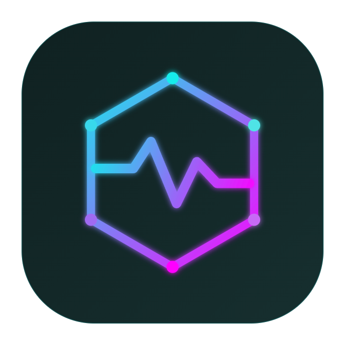
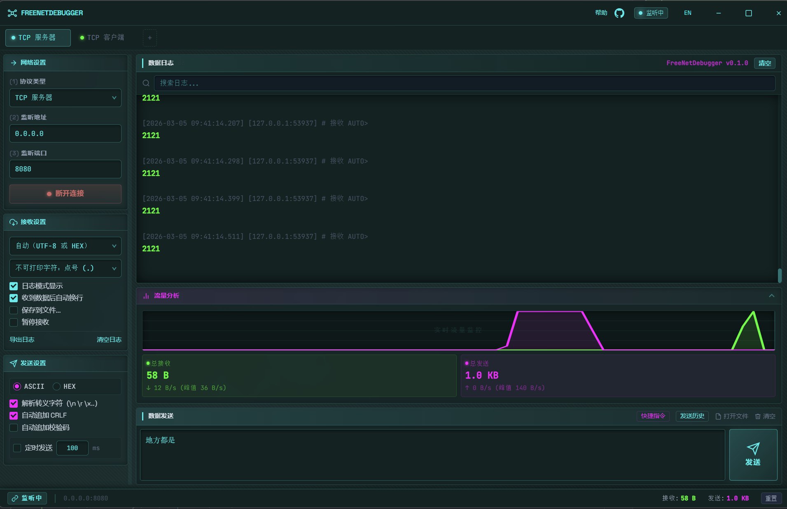
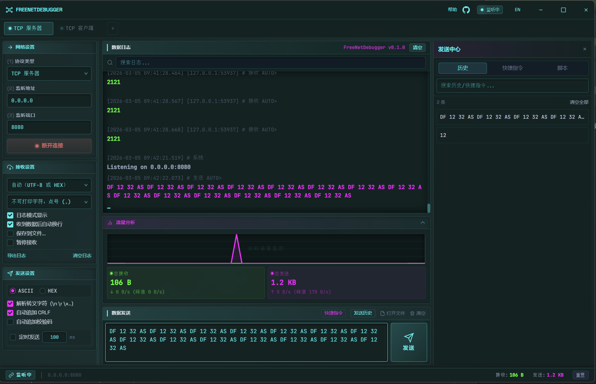
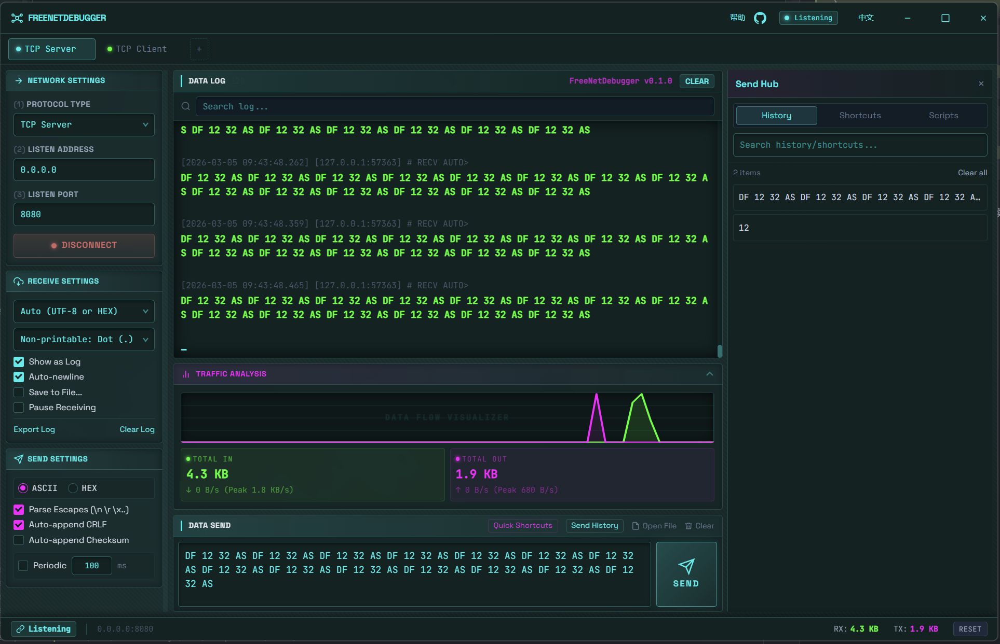
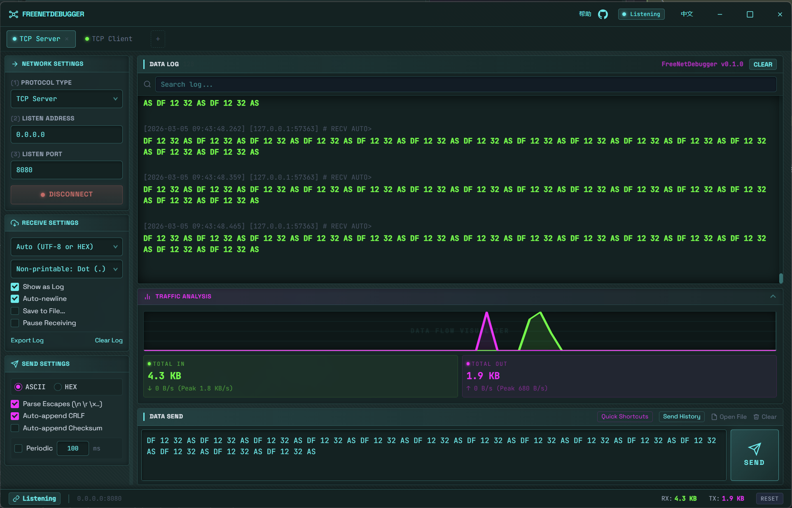

<div align="center">



## FreeNetDebugger

High-performance, cross-platform network debugging tool built with Tauri + Rust + React.

[](https://gitee.com/xddcode/free-net-debugger/stargazers)
[](https://gitee.com/xddcode/free-net-debugger/members)
[](https://github.com/xddcode/FreeNetDebugger/stargazers)
[](https://github.com/xddcode/FreeNetDebugger/network)
[](https://gitee.com/dromara/free-fs/blob/master/LICENSE)
[](LICENSE)
[](https://tauri.app)

[问题反馈](https://github.com/xddcode/FreeNetDebugger/issues) · [功能请求](https://github.com/xddcode/FreeNetDebugger/issues/new)

Repository:
[Gitee](https://gitee.com/xddcode/free-net-debugger) · [GitHub](https://github.com/xddcode/FreeNetDebugger)

**English | [中文](README.zh-CN.md)**

</div>

## Core Capabilities

- Multi-protocol support: `TCP Client/Server`, `UDP Client/Server`, `WebSocket`
- Real-time log panel with virtual scrolling and filtering
- Flexible send pipeline: ASCII/HEX, escape parsing, checksum, periodic send
- Send Center drawer: history, shortcuts, quick run/paste workflow
- Export and stream-to-file for long-running capture sessions
- Live traffic metrics: current throughput, peak, and totals

## Preview

| Preview 1 | Preview 2 |
| --------- | --------- |
|  |  |

| Preview 3 | Preview 4 |
| --------- | --------- |
|  |  |

## Tech Stack

- Frontend: React 19, TypeScript, Zustand, i18next, Tailwind CSS
- Backend: Rust, Tokio, Tauri v2
- Build: Vite

## Installation

### Option 1: Install Prebuilt Package (Recommended)

For production use, download the installer/package from the official release channels:

- [Download from GitHub Releases](https://github.com/xddcode/FreeNetDebugger/releases)
- [Download from SourceForge](https://sourceforge.net/projects/freenetdebugger/files/)
- Choose the asset that matches your OS and architecture (for example, Windows `.msi`, macOS `.dmg`)
- Install and launch directly

[](https://sourceforge.net/projects/freenetdebugger/files/)

### Option 2: Build and Install from Source

Use this path when you need custom builds, local patching, or development debugging.

#### Prerequisites

- Rust >= 1.77
- Node.js >= 20
- Bun (or npm/pnpm)
- Tauri prerequisites: <https://tauri.app/start/prerequisites/>

#### Build Installer/Bundle

```bash
bun install
bun tauri build
```

Output: `src-tauri/target/release/bundle/`

#### Development Mode

```bash
bun install
bun tauri dev
```

## Contact

- GitHub: [@Freedom](https://github.com/xddcode)
- Gitee: [@Freedom](https://gitee.com/xddcode)
- Email: xddcodec@gmail.com
- WeChat:

  **Please include your purpose when adding me on WeChat**


- WeChat Official Account:


---

## Donation

If FreeNetDebugger helps your work, gives you convenience, inspiration, or you simply support this project, you are welcome to sponsor its continued development.

Please leave a ⭐️ to support the project!


<div align="center">

Made with ❤️ by [@xddcode](https://gitee.com/xddcode)

</div>

## License

Apache License 2.0
